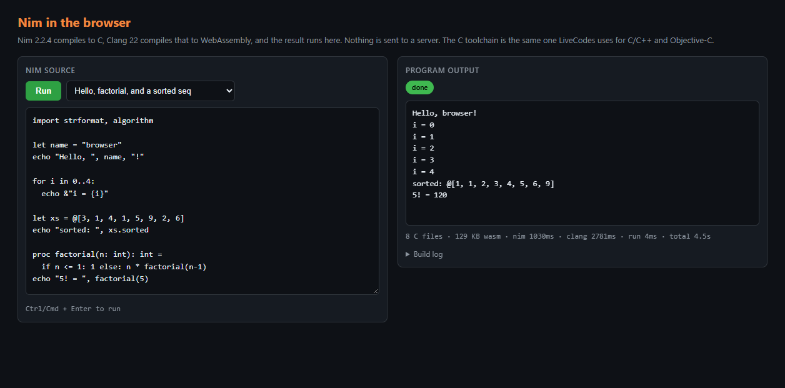

# browser-nim

Proof of concept: **compile and run Nim in the browser, with no server.** Nim 2.2.4 compiles the
source to C, the Clang 22 toolchain LiveCodes already ships compiles that to WebAssembly, and the
result is instantiated in the page. Nothing is sent anywhere, and there is no compilation backend.

```bash
npm install
npm run setup    # Nim compiler assets + the Clang toolchain + the page bundle
npm start        # http://localhost:4180
```

`npm start` is a plain static file server. It exists because the runtime fetches its assets over
HTTP and needs a real origin — it is not a compilation server, and nothing but static files is served.

<p align="center"></p>

## How it works

```
your Nim code
  │  nim.wasm + nim-bundle.js       Nim 2.2.4 compiled to wasm  (runs in the page)
  ▼
8 × .c
  │  clang.wasm                     @live-codes/clang-wasm's toolchain, one object per unit
  ▼
8 × .o
  │  lld.wasm                       same toolchain
  ▼
one unit-007.wasm  (129 KB)
  │  WebAssembly.instantiate + a WASI shim
  ▼
program output
```

The whole pipeline lives in three modules, one per stage:

| File | Stage |
| --- | --- |
| `src/nim-to-c.js` | Loads the Nim compiler and runs it, then reads the generated `.c` back out of its filesystem |
| `src/clang-build.js` | Compiles each translation unit and links them, then runs the module |
| `src/run-nim.js` | Wires the two together behind `runner.run(source)` |
| `src/wasi-signal-header.js` | The `<signal.h>` the pruned WASI sysroot does not have |

### Reusing `@live-codes/clang-wasm` rather than shipping a second compiler

`src/clang-build.js` drives the Clang runtime directly instead of going through the package's
`createCompiler(...).run(code)`. The reason is one option:

```ts
// @wasm-idle/llvm-core, BrowserClangCompileRequest
/** Lowercase .c/.cc/.cpp/.cxx siblings are separate translation units outside trace mode. */
workspaceFiles?: BrowserClangWorkspaceFile[];
```

Nim's `c` backend emits **one `.c` per module** — `@msystem.nim.c`, `@muser.nim.c`, and so on — and
they cannot simply be concatenated, because each one declares the same types (`struct Exception`,
`NIM_BOOL`, …) and would collide in a single translation unit. They have to be compiled separately and
linked. The runtime supports exactly that through `workspaceFiles`; the package's `run()` does not
forward the option yet.

So the gap is small and worth closing — see [the change that removes this
workaround](#the-change-that-removes-this-workaround) below. Everything else is already shared: the
same `BrowserClangRuntime`, the same `vendor/clang` asset tree (**copied with the package's own
`clang-wasm-copy-assets` script**), and the same `executeBrowserClangArtifact`.

What the reuse buys, concretely: this adds **11 MB** (the Nim compiler) on top of a toolchain
LiveCodes already serves for C/C++ and Objective-C, rather than a second ~29 MB Clang.

## Findings

Six things had to be worked out. The first is a real bug in the toolchain that affects more than Nim.

### 1. `__GNUC__` is not defined, and it breaks nimbase.h

The runtime drives `clang -cc1` directly. `-cc1` does not define `__GNUC__`, because the version comes
from the *driver's* `-fgnuc-version` default:

```
$ probe.c:4: error: GNUC_NOT_defined
```

Nim's `nimbase.h` picks its `N_INLINE` macro with `#if defined(__GNUC__)`. Without it, it takes the
fallback `rettype __inline name`, which wasi-libc's `features.h` then rewrites to
`rettype inline name` — and since the parser is already past the `*` by then, that is a syntax error:

```
error: expected identifier or '('
    static N_INLINE(NIM_BOOL*, nimErrorFlag)(void);
    │      └─ expands to: static NIM_BOOL* inline nimErrorFlag(void);
```

The fix is one argument, restoring what a normal clang invocation does:

```js
export const GNUC_VERSION_ARG = '-fgnuc-version=4.2.1';
```

This is not Nim-specific. Any C that branches on `#if defined(__GNUC__)` silently gets the fallback
path through this runtime, so `@live-codes/clang-wasm` may want to pass it for C and C++ too.

### 2. Nim's three-argument `main` traps through the wrong entry point

Nim emits `int main(int argc, char** args, char** env)`. WASI's `crt1.o` reaches `main` through a
clang-generated wrapper — `__main_argc_argv` for a 2-argument `main`, and `__main_void` (which calls
`main()` with *no arguments*) for anything else. Through `__main_void`, Nim's runtime entry reads a
null `argv` and traps before printing:

```
RuntimeError: unreachable
    at main (unit-007.wasm)
    at __main_void (unit-007.wasm)
    at _start
```

Moving the third parameter out of the signature and setting it to null inside the body lands the
program on `__main_argc_argv` and gives it the real `argc`/`argv`.

### 3. The sysroot has no `<signal.h>`

The Clang runtime's sysroot is a pruned wasi-libc with the C++ headers restored on top. It has no
`signal.h` and no `setjmp.h`, but Nim's system module does `#include <signal.h>` and then calls
`signal()` and `raise()` while installing its `SIGSEGV`/`SIGABRT`/`SIGFPE` handlers.

`src/wasi-signal-header.js` supplies a minimal `<signal.h>` — the `SIG_*` values plus no-op `signal()`
and `raise()`. WASI has no signals, so nothing in it ever runs; a real trap aborts the instance
instead.

It is mounted at `include/wasm32-wasi/signal.h`, which is **already on the include path** the runtime
hands clang. That matters: between that and `nimbase.h` going at `include/nimbase.h`, the generated C
needs no rewriting at all. Its own `#include <signal.h>` and `#include "nimbase.h"` resolve as written.
(The `nimbase.h` the compiler does not ship is taken from `vendor/nim`, which is why `npm run setup`
fetches it.)

### 4. `-d:useMalloc` is mandatory, not a preference

The runtime's default link line is:

```
wasm-ld --export-dynamic -z stack-size=1048576 ... crt1.o <objects> -lc -lc++ -lc++abi -lm \
  -Llib/clang/22/lib/wasi -lclang_rt.builtins-wasm32 -o out.wasm
```

There is no `-lwasi-emulated-mman`, although the sysroot does ship `libwasi-emulated-mman.a` (the
Objective-C driver adds it explicitly). Nim's default allocator grows memory with `mmap`, so it fails
to link. `-d:useMalloc` routes allocation through wasi-libc's dlmalloc, which grows linear memory
directly.

### 5. `--compileOnly` turns a bogus failure into a clean exit

The `c` backend's last act is to shell out to gcc on the files it just generated. There is no gcc, so
every compile ends in `execution of an external program failed` and a non-zero exit — and on a machine
that *does* have a compiler on `PATH`, the call actually runs, reaching the real filesystem with paths
like `/home/web_user/.cache/nim/...`. Either way the exit code says nothing about whether code
generation succeeded.

`--compileOnly` stops before that step:

| | files | exit | time | invokes a host CC |
| --- | --- | --- | --- | --- |
| default | 5 | 1 | 1110 ms | yes |
| `--compileOnly` | 5 | **0** | **347 ms** | **no** |

Same generated C, three times quicker, and the exit code becomes a real success signal. The flags also
have to precede the source path — anything after it is taken as the program's arguments.

### 6. Two small ones that only show up outside a browser

- **`SharedArrayBuffer`.** The runtime's memory wrapper does `buf instanceof SharedArrayBuffer`
  unconditionally, which throws on a page that is not cross-origin isolated. A stub is enough, and it
  is what `@live-codes/clang-wasm` installs for the same reason.
- **`Module.quit`.** The Nim bundle's Node branch defaults `quit` to a function that sets
  `process.exitCode` before throwing, so a program that fails to compile sets the *host* process's exit
  status. Overriding it keeps the status with the caller.

Also worth noting for anyone copying the approach: the widely-linked reference demo captures the
compiler's output by overwriting `window.print`, but Emscripten binds its streams at load time from
`Module.print`/`Module.printErr` (`var out=Module["print"]||console.log.bind(console)`), so that
capture never sees anything. Setting a `Nim` module object before the script loads is what actually
works — and it is how Nim's errors and warnings reach the diagnostics panel here.

## Verification

```bash
npm test    # node --test test/*.test.mjs
```

- **`test/pipeline.test.mjs`** — end to end: Nim to C, the generated C to one wasm module and a run,
  plus a compile error that must stop before the C compiler. The Clang half is real: the same runtime,
  the same assets, over HTTP, exactly as the page loads them.
- **`test/samples.test.mjs`** — every sample the page offers, compiled and run. The samples live in
  `src/samples.js` and are shared with the page, so the picker cannot drift into offering something
  broken.
- **`test/nim-node-context.mjs`** — the Nim compiler driven from Node in a `vm` context, so the Nim →
  C half iterates in seconds instead of a browser round trip.

Measured in Chromium, warm (assets already loaded):

| | |
| --- | --- |
| Nim → C (8 units) | 0.5 – 1.9 s |
| compile + link | 2.3 – 7.4 s |
| run | 4 – 8 ms |
| total | 3 – 11 s |

First load is ~11 MB of Nim assets plus ~29 MB of Clang assets. The clang runtime is cached per asset
URL, so it is paid once per page.

## The change that removes this workaround

`@live-codes/clang-wasm` needs to pass `workspaceFiles` through. Two small edits:

```js
// src/api.js — accept the option
const params = {
  code,
  input: input ?? '',
  language: resolved,
  fileName: runOptions.fileName ?? defaults.fileName,
  args: runOptions.args ?? defaults.args,
  std: runStd,
  workspaceFiles: runOptions.workspaceFiles ?? [],        // added
  compileArgs: [ /* unchanged */ ]
};
```

```js
// src/compile.js — runClangFamily, hand it to the runtime
const compiled = await captureCompilerOutput(record, () =>
  runtime.compileArtifact(code, {
    language: language.compilerLanguage,
    fileName,
    compileArgs,
    workspaceFiles                                       // added
  })
);
```

With that, `src/clang-build.js` collapses to a `createCompiler('c', { baseUrl })` and a `run()` call
with the sibling units attached — one shared runtime with C/C++, one asset load, and no reaching past
the package API. Worth documenting in the README's option table at the same time, since
`workspaceFiles` is otherwise an option only the runtime knows about.

## Next steps

1. **Get it off the main thread.** The runtime blocks whatever thread it runs on and this is several
   seconds of work, so the page freezes during a build. LiveCodes already runs its C/C++ compiler in a
   worker for this reason, and that is where this belongs. The Nim bundle is a classic script, so the
   worker needs `importScripts` rather than the `<script>` tag `src/nim-to-c.js` uses today.
2. **Build and pin `nim.wasm` in-house.** `npm run assets:nim` fetches a third-party prebuilt bundle
   from someone's GitHub Pages. It works and is recorded in `asset-receipts.json`, but it should be
   built from the Nim sources and pinned the way the Clang assets are, ideally as a versioned
   `@live-codes` package.
3. **Trim the Nim runtime.** `-d:release` with `--compileOnly` still generates ~130 KB of wasm for a
   hello world. Link with `--gc-sections` (the Objective-C driver already does) and consider `-d:danger`
   for a playground.
4. **Then wire it into LiveCodes** as a language module with `nim` syntax highlighting, following the
   `lang-cpp-wasm-script.ts` shim, with the worker hosting both toolchains.

## Known limitations

- **No threads.** `-d:useMalloc` plus a single-threaded WASI sysroot means `--threads:on` will not work.
- **No signals**, so Nim's segfault handler and Ctrl-C handling do not exist (see finding 3).
- **No real file I/O.** The program gets a WASI preview-1 environment with no preopened directories;
  reading or writing files will fail. stdin and argv are not wired up in the page yet, though
  `runner.run(source, { args, stdin })` already accepts both.
- **`--exceptions:setjmp` will not build** — there is no `setjmp.h` in the sysroot, and no `jmp_buf`
  shim here. The default exceptions implementation works.
- **First load is heavy** (~40 MB), and there is no integrity checking on the Nim assets beyond the
  recorded receipt.

## Licensing and provenance

MIT for the code here, matching `@live-codes/clang-wasm` and the Nim standard library.

- `vendor/nim/nim.wasm`, `nim-bundle.js` — Nim 2.2.4 (MIT), built to wasm by the
  [Nim-WASM-Compiler](https://github.com/benagastov/Nim-WASM-Compiler) project, whose glue and patches
  are MIT. Its generated-C preparation is not used: the C is compiled as Nim emits it, apart from the
  entry point.
- `vendor/nim/nimbase.h` — Nim (MIT).
- `vendor/clang/` — Clang and LLD (Apache-2.0 with the LLVM exception), memfs, the sysroot, and the
  GNUstep libobjc2 runtime (MIT), copied from `@live-codes/clang-wasm`. See that package's
  `THIRD-PARTY-NOTICES.md`.

`vendor/` is not committed; `npm run setup` reproduces it.
